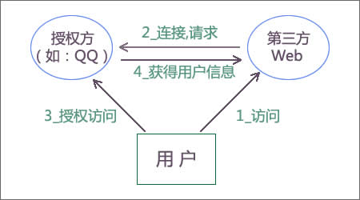

# OAuth

## 什么是OAuth?

OAuth（开放授权）是一个开放标准，允许用户让第三方应用访问该用户在某一网站上存储的私密的资源（如照片，视频，联系人列表），而无需将用户名和密码提供给第三方应用。

目前主流是2.0

OAuth 2.0是OAuth协议的下一版本，但不向后兼容OAuth 1.0。 

OAuth 2.0关注客户端开发者的简易性，同时为Web应用，桌面应用和手机，和起居室设备提供专门的认证流程。2012年10月，OAuth 2.0协议正式发布为RFC 6749[1]  。

主要是api

- 微博api
- twitter
- facebook
- github
- qq、微信

## 原理




http://www.ruanyifeng.com/blog/2014/05/oauth_2_0.html


server


-（A）用户打开客户端以后，客户端要求用户给予授权。
-（B）用户同意给予客户端授权。
-（C）客户端使用上一步获得的授权，向认证服务器申请令牌。
-（D）认证服务器对客户端进行认证以后，确认无误，同意发放令牌。
-（E）客户端使用令牌，向资源服务器申请获取资源。
-（F）资源服务器确认令牌无误，同意向客户端开放资源。

## OAuth in nodejs


实现

- [https://github.com/thomseddon/node-oauth2-server](Complete, compliant and well tested module for implementing an OAuth2 Server/Provider with express in node.js)
- [Simple, unobtrusive authentication for Node.js.](https://github.com/jaredhanson/passport)

## 微信OAuth说明

如果用户在微信客户端中访问第三方网页，公众号可以通过微信网页授权机制，来获取用户基本信息，进而实现业务逻辑。

关于网页授权回调域名的说明

1、在微信公众号请求用户网页授权之前，开发者需要先到公众平台官网中的开发者中心页配置授权回调域名。请注意，这里填写的是域名（是一个字符串），而不是URL，因此请勿加http://等协议头；
2、授权回调域名配置规范为全域名，比如需要网页授权的域名为：www.qq.com，配置以后此域名下面的页面http://www.qq.com/music.html 、 http://www.qq.com/login.html 都可以进行OAuth2.0鉴权。但http://pay.qq.com 、 http://music.qq.com 、 http://qq.com无法进行OAuth2.0鉴权
3、如果公众号登录授权给了第三方开发者来进行管理，则不必做任何设置，由第三方代替公众号实现网页授权即可

关于网页授权的两种scope的区别说明

1、以snsapi_base为scope发起的网页授权，是用来获取进入页面的用户的openid的，并且是静默授权并自动跳转到回调页的。用户感知的就是直接进入了回调页（往往是业务页面）
2、以snsapi_userinfo为scope发起的网页授权，是用来获取用户的基本信息的。但这种授权需要用户手动同意，并且由于用户同意过，所以无须关注，就可在授权后获取该用户的基本信息。
3、用户管理类接口中的“获取用户基本信息接口”，是在用户和公众号产生消息交互或关注后事件推送后，才能根据用户OpenID来获取用户基本信息。这个接口，包括其他微信接口，都是需要该用户（即openid）关注了公众号后，才能调用成功的。


关于网页授权access_token和普通access_token的区别

1、微信网页授权是通过OAuth2.0机制实现的，在用户授权给公众号后，公众号可以获取到一个网页授权特有的接口调用凭证（网页授权access_token），通过网页授权access_token可以进行授权后接口调用，如获取用户基本信息；
2、其他微信接口，需要通过基础支持中的“获取access_token”接口来获取到的普通access_token调用。

关于UnionID机制

1、请注意，网页授权获取用户基本信息也遵循UnionID机制。即如果开发者有在多个公众号，或在公众号、移动应用之间统一用户帐号的需求，需要前往微信开放平台（open.weixin.qq.com）绑定公众号后，才可利用UnionID机制来满足上述需求。
2、UnionID机制的作用说明：如果开发者拥有多个移动应用、网站应用和公众帐号，可通过获取用户基本信息中的unionid来区分用户的唯一性，因为同一用户，对同一个微信开放平台下的不同应用（移动应用、网站应用和公众帐号），unionid是相同的。


关于特殊场景下的静默授权

1、上面已经提到，对于以snsapi_base为scope的网页授权，就静默授权的，用户无感知；
2、对于已关注公众号的用户，如果用户从公众号的会话或者自定义菜单进入本公众号的网页授权页，即使是scope为snsapi_userinfo，也是静默授权，用户无感知。


具体而言，网页授权流程分为四步：

1、引导用户进入授权页面同意授权，获取code
2、通过code换取网页授权access_token（与基础支持中的access_token不同）
3、如果需要，开发者可以刷新网页授权access_token，避免过期
4、通过网页授权access_token和openid获取用户基本信息（支持UnionID机制）


## install

https://github.com/node-webot/wechat-oauth

```
npm install wechat-oauth
```


## 创建routes/oauth.js

```
var express = require('express');
var router = express.Router();

var OAuth = require('wechat-oauth');
var client = new OAuth('wx1627638f56ff80a5', 'd9df5debf4e37def18cc5e37326b604e');

/* GET users listing. */
router.get('/', function (req, res, next) {
	var domain = "https://topfio-3001-rsqevg.box.myide.io"
	var auth_callback_url = domain + "/oauth/callback"
	var url = client.getAuthorizeURL(auth_callback_url, '', 'snsapi_userinfo');
	console.log(url);
	// 重定向请求到微信服务器
	res.redirect(url);
});

router.get('/callback', function (req, res, next) {
	var code = req.query.code;
	client.getAccessToken(code, function (err, result) {
		console.log(result)
		var accessToken = result.data.access_token;
		var openid = result.data.openid;

		client.getUser(openid, function (err, result) {
			var userInfo = result;
			// save or other opration
			res.json(userInfo)
		});
	});
});

module.exports = router;
```

## callback之后

。。。


https://cnodejs.org/topic/555fec114eb040084cfe5d15
